# Laporan Penjelasan dan Penyelesaian Soal Modul 2

بِسْمِ اللهِ الرَّحْمٰنِ الرَّحِيْمِ

Segala puji bagi Allah, Rabb semesta alam. Shalawat dan salam semoga tercurah kepada Nabi Muhammad ﷺ, keluarga, sahabat, serta siapa saja yang mengikuti jalan beliau hingga hari kiamat.

Laporan ini disusun sebagai bentuk tanggung jawab akademik dan ikhtiar dalam menuntut ilmu, sebagaimana sabda Nabi ﷺ:

"Barangsiapa menempuh jalan untuk menuntut ilmu, niscaya Allah akan mudahkan baginya jalan menuju surga."

(HR. Muslim)

Semoga apa yang tertulis dalam laporan ini menjadi sebab keberkahan, ilmu yang bermanfaat, dan amal yang diterima di sisi Allah ﷻ.

Semoga Allah memudahkan langkah kita semua dalam menuntut ilmu, mengamalkannya, serta menjaganya agar tidak sekadar jadi hafalan di otak, tapi bekal untuk akhirat.


## Anggota Kelompok
| Nama                      | NRP        |
|---------------------------|------------|
|Muhammad Hikari Reiziq R.  | 5027241079 |
|Dira Muhammad Ilyas S. A.  | 5027241033 |
|Thariq Kyran Aryunaldi     | 5027241073 |

## Soal 1
### a. Download & Ekstrak (download_and_extract())

❦ Tujuan:

> Unduh Clues.zip dari Google Drive (jika folder Clues/ belum ada).
>
> Ekstrak isinya dan hapus file ZIP.

❦ Algoritma:

> Cek apakah folder Clues/ sudah ada.
>
> Jika belum:
>     Gunakan wget untuk download.
>
> Gunakan unzip untuk ekstrak.
>
> Hapus Clues.zip dengan rm.

Kode:
```
void download_and_extract() {
    struct stat st = {0};
    if (stat(FOLDER_NAME, &st) == 0 && S_ISDIR(st.st_mode)) {
        return; // Folder sudah ada, skip.
    }

    // Download Clues.zip
    char *wget_args[] = {"wget", "-O", "Clues.zip", "https://drive.google.com/...", NULL};
    run_command(wget_args);

    // Ekstrak
    char *unzip_args[] = {"unzip", "Clues.zip", NULL};
    run_command(unzip_args);

    // Hapus ZIP
    char *rm_args[] = {"rm", "Clues.zip", NULL};
    run_command(rm_args);
}
```
Fungsi penduikung (run_command):
```
void run_command(char *argv[]) {
    pid_t pid = fork();
    if (pid == 0) { // Child process
        execvp(argv[0], argv); // Jalankan perintah (e.g., wget, unzip)
        exit(EXIT_FAILURE); // Jika execvp gagal
    } else { // Parent process
        waitpid(pid, NULL, 0); // Tunggu child selesai
    }
}
```

---

### b. Filter File (filter_files())
❦ Tujuan:

> Pindahkan file dengan nama 1 huruf/angka + .txt (e.g., a.txt, 1.txt) ke folder Filtered/.
>
> Hapus file yang tidak valid.

❦ Algoritma:

> Buat folder Filtered/.
>
> Loop melalui ClueA/ sampai ClueD/:
>
> Baca setiap file di direktori.
>
> Jika nama file valid:
>
> Pindahkan ke Filtered/ dengan mv.
>
> Jika tidak valid:
>
> Hapus dengan rm.

#### Kode
``` action.c

void filter_files() {
    mkdir(FILTERED_FOLDER, 0777); // Buat folder Filtered
    for (char folder = 'A'; folder <= 'D'; folder++) {
        char path[512];
        snprintf(path, sizeof(path), "%s/Clue%c", FOLDER_NAME, folder);

        DIR *dir = opendir(path);
        if (!dir) continue; // Skip jika folder tidak ada

        struct dirent *entry;
        while ((entry = readdir(dir)) != NULL) {
            // Abaikan file hidden (., ..)
            if (entry->d_name[0] == '.') continue;

            char full_path[512];
            snprintf(full_path, sizeof(full_path), "%s/%s", path, entry->d_name);

            // Cek apakah nama file valid (e.g., a.txt, 1.txt)
            if (is_valid_single_char_filename(entry->d_name)) {
                char *mv_args[] = {"mv", full_path, FILTERED_FOLDER, NULL};
                run_command(mv_args);
            } else {
                char *rm_args[] = {"rm", full_path, NULL};
                run_command(rm_args);
            }
        }
        closedir(dir);
    }
}
```

Fungsi untuk memvalidasi nama file:

``` action.c
int is_valid_single_char_filename(const char *filename) {
    // Format: [a-Z0-9].txt (panjang 5: a.txt)
    return (strlen(filename) == 5 && 
            isalnum(filename[0]) && 
            strcmp(filename + 1, ".txt") == 0);
}
```

---

### c. Gabungkan File (combine_files())
❦ Tujuan:

> Gabungkan isi file di Filtered/ ke Combined.txt dengan urutan:
> 
> angka → huruf → angka → huruf (e.g., 1.txt, a.txt, 2.txt, b.txt).
> 
> Hapus file aslinya setelah digabung.

❦ Algoritma:

> Buka folder Filtered/ dan pisahkan file:
>
> digit_files: File dengan nama angka (e.g., 1.txt).
>
> alpha_files: File dengan nama huruf (e.g., a.txt).
> 
> Urutkan kedua kelompok file.
> 
> Gabungkan isinya secara bergantian ke Combined.txt.
> 
> Hapus file sumber.

Kode:
```
void combine_files() {
    DIR *dir = opendir(FILTERED_FOLDER);
    if (!dir) return;

    // Pisahkan file angka dan huruf
    char *digit_files[128], *alpha_files[128];
    int d_count = 0, a_count = 0;

    struct dirent *entry;
    while ((entry = readdir(dir)) != NULL) {
        if (entry->d_name[0] == '.') continue;

        if (isdigit(entry->d_name[0])) {
            digit_files[d_count++] = strdup(entry->d_name);
        } else if (isalpha(entry->d_name[0])) {
            alpha_files[a_count++] = strdup(entry->d_name);
        }
    }
    closedir(dir);

    // Urutkan file
    qsort(digit_files, d_count, sizeof(char *), compare_names);
    qsort(alpha_files, a_count, sizeof(char *), compare_names);

    // Gabungkan isi file
    FILE *out = fopen(COMBINED_FILE, "w");
    for (int i = 0; i < (d_count > a_count ? d_count : a_count); i++) {
        if (i < d_count) {
            char file_path[512];
            snprintf(file_path, sizeof(file_path), "%s/%s", FILTERED_FOLDER, digit_files[i]);
            append_file_to_output(file_path, out);
            remove(file_path); // Hapus file sumber
            free(digit_files[i]);
        }
        if (i < a_count) {
            char file_path[512];
            snprintf(file_path, sizeof(file_path), "%s/%s", FILTERED_FOLDER, alpha_files[i]);
            append_file_to_output(file_path, out);
            remove(file_path); // Hapus file sumber
            free(alpha_files[i]);
        }
    }
    fclose(out);
}
```

Fungsi pendukung:

```
// Untuk sorting file
int compare_names(const void *a, const void *b) {
    const char *fa = *(const char **)a;
    const char *fb = *(const char **)b;
    return strcmp(fa, fb); // Urutkan secara leksikografis
}

// Salin isi file ke output
void append_file_to_output(const char *file_path, FILE *out) {
    FILE *in = fopen(file_path, "r");
    if (!in) return;

    char buffer[1024];
    while (fgets(buffer, sizeof(buffer), in)) {
        fputs(buffer, out);
    }
    fclose(in);
}
```


---

### d. Decode ROT13 (rot13_decode())
❦ Tujuan:

> Decode isi Combined.txt dengan cipher ROT13 (geser 13 huruf).
>
> Hasil disimpan di Decoded.txt.
>
> Algoritma ROT13:
> 
> Untuk setiap karakter:
> 
> Jika huruf (A-Z/a-z):
>
> Geser 13 posisi (e.g., A → N, n → a).
>
> Jika bukan huruf: biarkan as-is.

Kode:
```
void rot13_decode() {
    FILE *in = fopen(COMBINED_FILE, "r");
    FILE *out = fopen(DECODED_FILE, "w");

    int c;
    while ((c = fgetc(in)) != EOF) {
        if (isalpha(c)) {
            if (islower(c)) {
                c = 'a' + (c - 'a' + 13) % 26;
            } else {
                c = 'A' + (c - 'A' + 13) % 26;
            }
        }
        fputc(c, out);
    }

    fclose(in);
    fclose(out);
}
```

---

### Pics


---

### Ekstra
_Library yang digunakan:_
```
#include <stdio.h>      // File I/O (fopen, fgets, fprintf, etc.)
#include <stdlib.h>     // Memory allocation (malloc, free), exit()
#include <string.h>     // String operations (strcmp, strdup, strlen)
#include <sys/stat.h>   // File status (stat, mkdir, S_ISDIR)
#include <dirent.h>     // Directory operations (opendir, readdir, closedir)
#include <unistd.h>     // POSIX API (fork, execvp, getpid)
#include <ctype.h>      // Character checks (isalnum, isdigit, isalpha)
#include <sys/types.h>  // Process and file types (pid_t, etc.)
#include <sys/wait.h>   // Process control (wait, waitpid)
```

_Error handling:_

Prints help text if invalid arguments are given.
```
Example Output:
Usage:
  ./action             # Untuk download dan ekstrak Clues.zip
  ./action -m Filter   # Untuk filter file menjadi 1 huruf/angka
  ./action -m Combine  # Untuk menggabungkan isi file
  ./action -m Decode   # Untuk mendecode isi Combined.txt (ROT13)
```


## Soal 2

Pada suatu hari, Kanade ingin membuat sebuah musik baru bersama anggota grup musiknya, yaitu Mizuki Akiyama, Mafuyu Asahina, dan Ena Shinonome. Namun, sialnya, komputer Kanade terkena virus yang tidak dikenal. Setelah dianalisis secara mendalam, ternyata virus tersebut bukanlah trojan, ransomware, atau tipe virus berbahaya lainnya. Virus itu hanyalah malware biasa yang mampu membuat perangkat menjadi lebih lambat dari biasanya.

---

## **A. Download dan Unzip Starter Kit**

Sebagai teman yang baik, Mafuyu menyarankan agar Kanade mendownload dan mengekstrak (unzip) sebuah starter kit yang berisi file-file acak (termasuk virus) melalui link yang disediakan. Starter kit ini diharapkan dapat membantu Kanade mengidentifikasi virus-virus yang mungkin datang di masa depan.**Catatan:**

- Setelah proses unzip, **hapus file zip asli. (TERNYATA GA PERLU COMMAND MANUAL)**

```bash
wget "https://drive.usercontent.google.com/u/0/uc?id=1_5GxIGfQr3mNKuavJbte_AoRkEQLXSKS&export=download" -O starter_kit.zip && unzip starter_kit.zip -d starter_kit && rm starter_kit.zip
```

### Potongan Kode Utama:

```c
if (strcmp(argv[1], "--setup") == 0) {
    mkdir(STARTER_KIT_PATH, 0755);
    download_zip();
    unzip_file(ZIP_FILE, STARTER_KIT_PATH);
    remove(ZIP_FILE);
}

```

### Penjelasan:

- strcmp(argv[1], "--setup"): Mengecek apakah pengguna menjalankan perintah -setup.
- mkdir(...): Membuat folder starter_kit dengan permission 0755 (bisa diakses dan dibaca oleh semua orang).
- download_zip();: Memanggil fungsi untuk mengunduh file zip.
- unzip_file(...): Mengekstrak isi ZIP ke folder starter_kit.
- remove(...): Menghapus file zip setelah proses ekstraksi.

---

### Fungsi Lengkap download_zip():

```c
void download_zip() {
    CURL *curl = curl_easy_init();
    if (curl) {
        FILE *fp = fopen(ZIP_FILE, "wb");

```

- curl_easy_init(): Memulai objek curl.
- fopen(...): Membuka file ZIP untuk ditulis (mode "wb" = write binary).

```c
        curl_easy_setopt(curl, CURLOPT_URL, "<LINK>");
        curl_easy_setopt(curl, CURLOPT_WRITEFUNCTION, write_data);
        curl_easy_setopt(curl, CURLOPT_WRITEDATA, fp);
        curl_easy_setopt(curl, CURLOPT_FOLLOWLOCATION, 1L);

```

- curl_easy_setopt(...): Mengatur konfigurasi untuk curl.
    - CURLOPT_URL: Link tujuan download.
    - CURLOPT_WRITEFUNCTION: Fungsi callback saat data diterima.
    - CURLOPT_WRITEDATA: Menyimpan hasil download ke fp (file pointer).
    - CURLOPT_FOLLOWLOCATION: Mengizinkan redirect otomatis (diperlukan untuk Google Drive).

```c
        CURLcode res = curl_easy_perform(curl);
        if (res != CURLE_OK) {
            printf("Gagal download: %s\n", curl_easy_strerror(res));
        } else {
            printf("Download berhasil!\n");
        }

```

- curl_easy_perform(...): Menjalankan proses download.
- Jika gagal, tampilkan pesan error.

```c
        fclose(fp);
        curl_easy_cleanup(curl);

```

- fclose(fp): Menutup file ZIP yang dibuka.
- curl_easy_cleanup(...): Membersihkan memori curl.

---

### Fungsi Lengkap unzip_file():

```c
void unzip_file(const char *zip_path, const char *dest_dir) {
    int err = 0;
    zip_t *zip = zip_open(zip_path, 0, &err);

```

- zip_open(...): Membuka file ZIP. Jika gagal, variabel err akan menunjukkan kode kesalahan.

```c
    if (!zip) {
        printf("Gagal membuka zip: %s\n", zip_path);
        return;
    }

```

- Jika file zip tidak bisa dibuka, cetak pesan error dan keluar dari fungsi.

```c
    zip_int64_t num_entries = zip_get_num_entries(zip, 0);

```

- Mengambil jumlah file yang ada di dalam ZIP.

```c
    for (zip_uint64_t i = 0; i < num_entries; i++) {
        struct zip_stat st;
        zip_stat_init(&st);
        zip_stat_index(zip, i, 0, &st);

```

- Perulangan for untuk membaca semua file di ZIP.
- zip_stat adalah struktur untuk menyimpan informasi file.
- zip_stat_index(...) mengisi st dengan informasi file ke-i.

```c
        const char *filename = st.name;
        char path[512];
        snprintf(path, sizeof(path), "%s/%s", dest_dir, filename);

```

- Menyimpan nama file dan membuat path lengkap tujuan ekstraksi.

```c
        zip_file_t *zf = zip_fopen_index(zip, i, 0);
        if (!zf) continue;

```

- Membuka file ke-i dari ZIP.
- Jika gagal, lanjutkan ke file berikutnya.

```c
        FILE *out = fopen(path, "wb");
        if (!out) {
            zip_fclose(zf);
            continue;
        }

```

- Membuka file output di folder tujuan.
- Jika gagal membuka, file ZIP ditutup dan lanjut file berikutnya.

```c
        char buf[1024];
        zip_int64_t n;
        while ((n = zip_fread(zf, buf, sizeof(buf))) > 0) {
            fwrite(buf, 1, n, out);
        }

```

- Membaca isi file dalam ZIP dan menuliskannya ke disk secara bertahap (buffer).
- fwrite(...) menulis data hasil zip_fread(...) ke file asli.

```c
        fclose(out);
        zip_fclose(zf);
        printf("Ekstrak: %s\n", filename);
    }

```

- Menutup file setelah selesai ditulis.
- Menutup file dalam ZIP.
- Menampilkan nama file yang berhasil diekstrak.

```c
    zip_close(zip);
}

```

- Setelah semua selesai, file ZIP ditutup dengan zip_close().

---

## **B. Membuat Directory Karantina untuk Dekripsi**

Setelah mendownload starter kit tersebut, Mafuyu menyadari bahwa kit itu tidak menyertakan alat untuk mendekripsi nama file yang telah dienkripsi menggunakan algoritma Base64.Tugas Anda adalah membantu dengan membuat sebuah direktori karantina yang dapat mendekripsi nama file-file di dalamnya.**Hint:** Gunakan daemon. **Penggunaan:**

- ./starterkit --decrypt

### Potongan kode:

```c
if (strcmp(argv[1], "--decrypt") == 0) {
    mkdir(QUARANTINE_PATH, 0755);
    run_daemon();
}

```

### Penjelasan:

- strcmp(argv[1], "--decrypt"): Mengecek apakah pengguna mengetik perintah -decrypt.
- mkdir(...): Membuat folder quarantine jika belum ada.
- run_daemon(): Menjalankan proses daemon untuk dekripsi.

### Fungsi Lengkap run_daemon():

```c
void run_daemon() {
    pid_t pid = fork();
    if (pid < 0) exit(EXIT_FAILURE);
    if (pid > 0) {
        FILE *fp = fopen("decryption.pid", "w");
        if (fp) {
            fprintf(fp, "%d", pid);
            fclose(fp);
        }
        char logmsg[256];
        snprintf(logmsg, sizeof(logmsg), "Successfully started decryption process with PID %d.", pid);
        write_log(logmsg);
        exit(EXIT_SUCCESS);
    }

    umask(0);
    setsid();
    chdir(".");
    fclose(stdin);
    fclose(stdout);
    fclose(stderr);

    while (1) {
        decrypt_files();
        sleep(10);
    }
}

```

### Penjelasan run_daemon():

- fork(): Membuat proses baru. Jika pid > 0, maka ini proses induk dan akan langsung keluar.
- Proses anak akan lanjut dan menjadi **daemon**.
- setsid(): Membuat proses menjadi independen dari terminal (daemon sebenarnya).
- fclose(stdin); fclose(stdout); fclose(stderr);: Menutup input/output agar tidak terganggu terminal.
- Proses ini akan menjalankan decrypt_files() setiap 10 detik.

### Fungsi Lengkap decrypt_files():

```c
void decrypt_files() {
    DIR *dir = opendir(STARTER_KIT_PATH);
    if (!dir) {
        perror("Gagal membuka starter_kit");
        return;
    }

    struct dirent *entry;
    while ((entry = readdir(dir)) != NULL) {
        if (entry->d_name[0] == '.') continue;

        char old_path[512], new_path[512];
        snprintf(old_path, sizeof(old_path), "%s/%s", STARTER_KIT_PATH, entry->d_name);

        char *decoded = decode_base64(entry->d_name);
        if (!decoded) continue;

        snprintf(new_path, sizeof(new_path), "%s/%s", STARTER_KIT_PATH, decoded);
        if (rename(old_path, new_path) == 0) {
            char logmsg[512];
            snprintf(logmsg, sizeof(logmsg), "Successfully decrypted: %s", decoded);
            write_log(logmsg);
        }

        free(decoded);
    }

    closedir(dir);
}

```

### Penjelasan decrypt_files():

- opendir(...): Membuka folder starter_kit.
- readdir(...): Membaca file satu per satu dalam folder tersebut.
- if (entry->d_name[0] == '.') continue;: Melewati file yang tersembunyi (seperti . atau ..).
- snprintf(...): Membentuk path lengkap dari file asli dan nama hasil decode.
- decode_base64(...): Mengubah nama file dari base64 ke nama asli.
- rename(...): Mengganti nama file.
- write_log(...): Mencatat aktivitas ke activity.log.
- free(...): Membersihkan memori hasil decode.
- closedir(...): Menutup folder setelah selesai.

### Fungsi decode_base64():

```c
char *decode_base64(const char *input) {
    static const char table[] = "ABCDEFGHIJKLMNOPQRSTUVWXYZabcdefghijklmnopqrstuvwxyz0123456789+/";
    int len = strlen(input);
    int pad = 0;

    if (len % 4 != 0) return NULL;
    if (input[len - 1] == '=') pad++;
    if (input[len - 2] == '=') pad++;

    int out_len = (len * 3) / 4 - pad;
    char *decoded = malloc(out_len + 1);
    if (!decoded) return NULL;

    int val = 0, valb = -8, index = 0;
    for (int i = 0; i < len; i++) {
        char *p = strchr(table, input[i]);
        if (p) {
            val = (val << 6) + (p - table);
            valb += 6;
            if (valb >= 0) {
                decoded[index++] = (val >> valb) & 0xFF;
                valb -= 8;
            }
        }
    }

    decoded[out_len] = '\0';
    return decoded;
}

```

### Penjelasan decode_base64():

- Menggunakan algoritma standar Base64 untuk mengubah nama file yang terenkripsi menjadi bentuk aslinya.
- strchr(...): Mencari posisi karakter dalam tabel base64.
- val dan valb: Digunakan untuk menyusun ulang data asli dari karakter base64.
- malloc(...): Mengalokasikan memori untuk menyimpan hasil decoding.
- return decoded;: Mengembalikan string hasil decode.

---

## **C. Memindahkan File antara Starter Kit dan Karantina**

### Potongan kode perintah:

```c
else if (strcmp(argv[1], "--quarantine") == 0) {
    move_to_quarantine();
} else if (strcmp(argv[1], "--return") == 0) {
    return_from_quarantine();
}

```

Kode di atas akan menjalankan fungsi move_to_quarantine() jika argumen --quarantine diberikan, dan fungsi return_from_quarantine() jika argumen --return diberikan.

### Fungsi move_to_quarantine():

```c
void move_to_quarantine() {
    DIR *dir = opendir(STARTER_KIT_PATH);
    if (!dir) return;

    struct dirent *entry;
    while ((entry = readdir(dir)) != NULL) {
        if (entry->d_name[0] == '.') continue;

        char src[512], dst[512];
        snprintf(src, sizeof(src), "%s/%s", STARTER_KIT_PATH, entry->d_name);
        snprintf(dst, sizeof(dst), "%s/%s", QUARANTINE_PATH, entry->d_name);

        if (rename(src, dst) == 0) {
            char logmsg[512];
            snprintf(logmsg, sizeof(logmsg), "%s - Successfully moved to quarantine directory.", entry->d_name);
            write_log(logmsg);
        }
    }
    closedir(dir);
}

```

### Penjelasan move_to_quarantine():

- opendir(...): Membuka folder starter_kit untuk dibaca isinya.
- readdir(...): Membaca isi folder satu per satu.
- if (entry->d_name[0] == '.') continue;: Menghindari file atau folder tersembunyi seperti . dan ...
- snprintf(...): Menyusun path file lama (src) dan path baru (dst) ke folder quarantine.
- rename(...): Memindahkan file dari starter_kit ke quarantine.
- write_log(...): Menyimpan log ke file activity.log agar aktivitas tercatat.
- closedir(...): Menutup folder starter_kit setelah proses selesai.

### Fungsi return_from_quarantine():

```c
void return_from_quarantine() {
    DIR *dir = opendir(QUARANTINE_PATH);
    if (!dir) return;

    struct dirent *entry;
    while ((entry = readdir(dir)) != NULL) {
        if (entry->d_name[0] == '.') continue;

        char src[512], dst[512];
        snprintf(src, sizeof(src), "%s/%s", QUARANTINE_PATH, entry->d_name);
        snprintf(dst, sizeof(dst), "%s/%s", STARTER_KIT_PATH, entry->d_name);

        if (rename(src, dst) == 0) {
            char logmsg[512];
            snprintf(logmsg, sizeof(logmsg), "%s - Successfully returned to starter kit directory.", entry->d_name);
            write_log(logmsg);
        }
    }
    closedir(dir);
}

```

### Penjelasan return_from_quarantine():

- Fungsinya hampir sama dengan move_to_quarantine(), namun arah pemindahan dibalik.
- src adalah path file di folder quarantine.
- dst adalah path tujuan di folder starter_kit.
- File dikembalikan dari karantina ke folder utama.
- Aktivitas juga dicatat ke file log agar dapat dilacak di kemudian hari.

---

## **D. Fitur Penghapusan File pada Karantina**

### Potongan Kode:

```c
else if (strcmp(argv[1], "--eradicate") == 0) {
    erase_quarantine();
}

```

Kode di atas mengecek apakah pengguna menjalankan program dengan argumen --eradicate, dan jika ya, maka akan memanggil fungsi erase_quarantine().

### Fungsi erase_quarantine():

```c
void erase_quarantine() {
    DIR *dir = opendir(QUARANTINE_PATH);
    if (!dir) return;

    struct dirent *entry;
    while ((entry = readdir(dir)) != NULL) {
        if (entry->d_name[0] == '.') continue;

        char path[512];
        snprintf(path, sizeof(path), "%s/%s", QUARANTINE_PATH, entry->d_name);

        if (remove(path) == 0) {
            char logmsg[512];
            snprintf(logmsg, sizeof(logmsg), "%s - Successfully deleted.", entry->d_name);
            write_log(logmsg);
        }
    }
    closedir(dir);
}

```

### Penjelasan erase_quarantine():

- opendir(...): Membuka folder quarantine untuk membaca isinya.
- readdir(...): Membaca nama file satu per satu.
- entry->d_name[0] == '.': Menghindari file tersembunyi seperti . atau ...
- snprintf(...): Membuat path lengkap menuju file.
- remove(...): Menghapus file dari sistem.
- write_log(...): Mencatat bahwa file telah dihapus ke dalam activity.log.
- closedir(...): Menutup folder setelah semua file selesai diproses.

---

### E. Fungsi Mematikan Proses Daemon Berdasarkan PID

### Potongan kode:

```c
else if (strcmp(argv[1], "--shutdown") == 0) {
    shutdown_daemon();
}

```

Perintah ini akan mengeksekusi fungsi shutdown_daemon() jika pengguna mengetik --shutdown.

### Fungsi shutdown_daemon():

```c
void shutdown_daemon() {
    FILE *fp = fopen("decryption.pid", "r");
    if (!fp) {
        printf("PID file tidak ditemukan.\n");
        return;
    }

    int pid;
    fscanf(fp, "%d", &pid);
    fclose(fp);

    if (kill(pid, SIGTERM) == 0) {
        char logmsg[256];
        snprintf(logmsg, sizeof(logmsg), "Successfully shut off decryption process with PID %d.", pid);
        write_log(logmsg);
        remove("decryption.pid");
    } else {
        perror("Gagal mematikan proses");
    }
}

```

### Penjelasan shutdown_daemon():

- fopen(...): Membuka file decryption.pid yang berisi ID proses daemon.
- fscanf(...): Membaca angka PID dari file.
- kill(pid, SIGTERM): Mengirim sinyal ke proses agar dihentikan.
- Jika berhasil, log akan ditulis ke activity.log, dan file decryption.pid akan dihapus.
- Jika gagal, akan ditampilkan pesan error menggunakan perror().

---

## F. Penambahan Error Handling

### Mengecek argumen perintah dari pengguna

```c
if (argc != 2) {
    printf("Usage:
  ./starterkit --setup
  ./starterkit --decrypt
  ./starterkit --quarantine
  ./starterkit --return
  ./starterkit --eradicate
  ./starterkit --shutdown
");
    return 1;
}

```

Penjelasan:

- argc adalah jumlah argumen yang diberikan saat menjalankan program.
- Jika tidak sama dengan 2 (karena harus ada ./starterkit dan satu perintah), maka akan muncul petunjuk penggunaan.

### Mengecek keberhasilan membuka file

```c
FILE *fp = fopen("decryption.pid", "r");
if (!fp) {
    printf("PID file tidak ditemukan.
");
    return;
}

```

Penjelasan:

- fopen(...) membuka file. Jika file tidak ditemukan atau gagal dibuka, pointer fp akan bernilai NULL.
- Program akan berhenti dengan aman tanpa crash.

### Mengecek folder

```c
DIR *dir = opendir(STARTER_KIT_PATH);
if (!dir) {
    perror("Gagal membuka starter_kit");
    return;
}

```

Penjelasan:

- opendir(...) digunakan untuk membuka folder.
- Jika folder tidak ditemukan, program akan mencetak pesan kesalahan dan berhenti.
- perror(...) mencetak detail error dari sistem.

Dengan penambahan pengecekan ini, program menjadi lebih aman dan nyaman digunakan oleh pengguna.

---

## G. Fitur Pencatatan Log Aktivitas Program

**Tujuan:** Mencatat semua aktivitas penting ke dalam file log bernama activity.log, agar pengguna bisa meninjau ulang apa yang terjadi.

### Fungsi write_log():

```c
void write_log(const char *msg) {
    FILE *f = fopen(LOG_PATH, "a");
    if (!f) return;

    time_t now = time(NULL);
    struct tm *t = localtime(&now);

    fprintf(f, "[%02d-%02d-%04d][%02d:%02d:%02d] - %s
",
            t->tm_mday, t->tm_mon+1, t->tm_year+1900,
            t->tm_hour, t->tm_min, t->tm_sec, msg);

    fclose(f);
}

```

Penjelasan:

- fopen(..., "a"): Membuka file log dalam mode append (menambahkan di akhir baris).
- time(...) dan localtime(...): Mengambil waktu saat ini.
- fprintf(...): Menulis format waktu dan pesan ke file.
- Format log akan tampil seperti berikut:

```
[12-04-2025][14:55:30] - Successfully decrypted: virus123.dll
[12-04-2025][15:00:01] - virus123.dll - Successfully moved to quarantine directory.

```

Log ini dicatat di setiap bagian penting program, seperti:

- Saat proses dekripsi dimulai
- Saat file berhasil dipindahkan
- Saat file dikembalikan dari karantina
- Saat file dihapus
- Saat daemon dimatikan

---

## **Codingan lengkap :**

```cpp
#include <stdio.h>
#include <stdlib.h>
#include <string.h>
#include <dirent.h>
#include <unistd.h>
#include <time.h>
#include <sys/types.h>
#include <sys/stat.h>
#include <signal.h>
#include <curl/curl.h>
#include <zip.h>

#define STARTER_KIT_PATH "starter_kit"
#define QUARANTINE_PATH "quarantine"
#define LOG_PATH "activity.log"
#define ZIP_FILE "starter_kit.zip"

size_t write_data(void *ptr, size_t size, size_t nmemb, FILE *stream) {
    return fwrite(ptr, size, nmemb, stream);
}

void download_zip() {
    CURL *curl = curl_easy_init();
    if (curl) {
        FILE *fp = fopen(ZIP_FILE, "wb");
        if (!fp) {
            printf("Gagal membuat file %s\n", ZIP_FILE);
            return;
        }

        curl_easy_setopt(curl, CURLOPT_URL, "https://drive.usercontent.google.com/u/0/uc?id=1_5GxIGfQr3mNKuavJbte_AoRkEQLXSKS&export=download");
        curl_easy_setopt(curl, CURLOPT_WRITEFUNCTION, write_data);
        curl_easy_setopt(curl, CURLOPT_WRITEDATA, fp);
        curl_easy_setopt(curl, CURLOPT_FOLLOWLOCATION, 1L);

        CURLcode res = curl_easy_perform(curl);
        if (res != CURLE_OK) {
            printf("Gagal download: %s\n", curl_easy_strerror(res));
        } else {
            printf("Download berhasil!\n");
        }

        fclose(fp);
        curl_easy_cleanup(curl);
    } else {
        printf("Inisialisasi curl gagal\n");
    }
}

void unzip_file(const char *zip_path, const char *dest_dir) {
    int err = 0;
    zip_t *zip = zip_open(zip_path, 0, &err);
    if (!zip) {
        printf("Gagal membuka zip: %s\n", zip_path);
        return;
    }

    zip_int64_t num_entries = zip_get_num_entries(zip, 0);
    for (zip_uint64_t i = 0; i < num_entries; i++) {
        struct zip_stat st;
        zip_stat_init(&st);
        zip_stat_index(zip, i, 0, &st);

        const char *filename = st.name;
        char path[512];
        snprintf(path, sizeof(path), "%s/%s", dest_dir, filename);

        zip_file_t *zf = zip_fopen_index(zip, i, 0);
        if (!zf) continue;

        FILE *out = fopen(path, "wb");
        if (!out) {
            zip_fclose(zf);
            continue;
        }

        char buf[1024];
        zip_int64_t n;
        while ((n = zip_fread(zf, buf, sizeof(buf))) > 0) {
            fwrite(buf, 1, n, out);
        }

        fclose(out);
        zip_fclose(zf);
        printf("Ekstrak: %s\n", filename);
    }

    zip_close(zip);
}

char *decode_base64(const char *input) {
    static const char table[] = "ABCDEFGHIJKLMNOPQRSTUVWXYZabcdefghijklmnopqrstuvwxyz0123456789+/";
    int len = strlen(input);
    int pad = 0;

    if (len % 4 != 0) return NULL;
    if (input[len - 1] == '=') pad++;
    if (input[len - 2] == '=') pad++;

    int out_len = (len * 3) / 4 - pad;
    char *decoded = malloc(out_len + 1);
    if (!decoded) return NULL;

    int val = 0, valb = -8, index = 0;
    for (int i = 0; i < len; i++) {
        char *p = strchr(table, input[i]);
        if (p) {
            val = (val << 6) + (p - table);
            valb += 6;
            if (valb >= 0) {
                decoded[index++] = (val >> valb) & 0xFF;
                valb -= 8;
            }
        }
    }

    decoded[out_len] = '\0';
    return decoded;
}

void write_log(const char *msg) {
    FILE *f = fopen(LOG_PATH, "a");
    if (!f) return;

    time_t now = time(NULL);
    struct tm *t = localtime(&now);

    fprintf(f, "[%02d-%02d-%04d][%02d:%02d:%02d] - %s\n",
            t->tm_mday, t->tm_mon+1, t->tm_year+1900,
            t->tm_hour, t->tm_min, t->tm_sec, msg);

    fclose(f);
}

void decrypt_files() {
    DIR *dir = opendir(STARTER_KIT_PATH);
    if (!dir) {
        perror("Gagal membuka starter_kit");
        return;
    }

    struct dirent *entry;
    while ((entry = readdir(dir)) != NULL) {
        if (entry->d_name[0] == '.') continue;

        char old_path[512], new_path[512];
        snprintf(old_path, sizeof(old_path), "%s/%s", STARTER_KIT_PATH, entry->d_name);

        char *decoded = decode_base64(entry->d_name);
        if (!decoded) continue;

        snprintf(new_path, sizeof(new_path), "%s/%s", STARTER_KIT_PATH, decoded);
        if (rename(old_path, new_path) == 0) {
            char logmsg[512];
            snprintf(logmsg, sizeof(logmsg), "Successfully decrypted: %s", decoded);
            write_log(logmsg);
        }

        free(decoded);
    }

    closedir(dir);
}

void move_to_quarantine() {
    DIR *dir = opendir(STARTER_KIT_PATH);
    if (!dir) return;

    struct dirent *entry;
    while ((entry = readdir(dir)) != NULL) {
        if (entry->d_name[0] == '.') continue;

        char src[512], dst[512];
        snprintf(src, sizeof(src), "%s/%s", STARTER_KIT_PATH, entry->d_name);
        snprintf(dst, sizeof(dst), "%s/%s", QUARANTINE_PATH, entry->d_name);

        if (rename(src, dst) == 0) {
            char logmsg[512];
            snprintf(logmsg, sizeof(logmsg), "%s - Successfully moved to quarantine directory.", entry->d_name);
            write_log(logmsg);
        }
    }
    closedir(dir);
}

void return_from_quarantine() {
    DIR *dir = opendir(QUARANTINE_PATH);
    if (!dir) return;

    struct dirent *entry;
    while ((entry = readdir(dir)) != NULL) {
        if (entry->d_name[0] == '.') continue;

        char src[512], dst[512];
        snprintf(src, sizeof(src), "%s/%s", QUARANTINE_PATH, entry->d_name);
        snprintf(dst, sizeof(dst), "%s/%s", STARTER_KIT_PATH, entry->d_name);

        if (rename(src, dst) == 0) {
            char logmsg[512];
            snprintf(logmsg, sizeof(logmsg), "%s - Successfully returned to starter kit directory.", entry->d_name);
            write_log(logmsg);
        }
    }
    closedir(dir);
}

void erase_quarantine() {
    DIR *dir = opendir(QUARANTINE_PATH);
    if (!dir) return;

    struct dirent *entry;
    while ((entry = readdir(dir)) != NULL) {
        if (entry->d_name[0] == '.') continue;

        char path[512];
        snprintf(path, sizeof(path), "%s/%s", QUARANTINE_PATH, entry->d_name);

        if (remove(path) == 0) {
            char logmsg[512];
            snprintf(logmsg, sizeof(logmsg), "%s - Successfully deleted.", entry->d_name);
            write_log(logmsg);
        }
    }
    closedir(dir);
}

void shutdown_daemon() {
    FILE *fp = fopen("decryption.pid", "r");
    if (!fp) {
        printf("PID file tidak ditemukan.\n");
        return;
    }

    int pid;
    fscanf(fp, "%d", &pid);
    fclose(fp);

    if (kill(pid, SIGTERM) == 0) {
        char logmsg[256];
        snprintf(logmsg, sizeof(logmsg), "Successfully shut off decryption process with PID %d.", pid);
        write_log(logmsg);
        remove("decryption.pid");
    } else {
        perror("Gagal mematikan proses");
    }
}

void run_daemon() {
    pid_t pid = fork();
    if (pid < 0) exit(EXIT_FAILURE);
    if (pid > 0) {
        FILE *fp = fopen("decryption.pid", "w");
        if (fp) {
            fprintf(fp, "%d", pid);
            fclose(fp);
        }
        char logmsg[256];
        snprintf(logmsg, sizeof(logmsg), "Successfully started decryption process with PID %d.", pid);
        write_log(logmsg);
        exit(EXIT_SUCCESS);
    }

    umask(0);
    setsid();
    chdir(".");
    fclose(stdin);
    fclose(stdout);
    fclose(stderr);

    while (1) {
        decrypt_files();
        sleep(10);
    }
}

int main(int argc, char *argv[]) {
    if (argc != 2) {
        printf("Usage:\n  ./starterkit --setup\n  ./starterkit --decrypt\n  ./starterkit --quarantine\n  ./starterkit --return\n  ./starterkit --eradicate\n  ./starterkit --shutdown\n");
        return 1;
    }

    if (strcmp(argv[1], "--setup") == 0) {
        mkdir(STARTER_KIT_PATH, 0755);
        download_zip();
        unzip_file(ZIP_FILE, STARTER_KIT_PATH);
        remove(ZIP_FILE);
    } else if (strcmp(argv[1], "--decrypt") == 0) {
        mkdir(QUARANTINE_PATH, 0755);
        run_daemon();
    } else if (strcmp(argv[1], "--quarantine") == 0) {
        move_to_quarantine();
    } else if (strcmp(argv[1], "--return") == 0) {
        return_from_quarantine();
    } else if (strcmp(argv[1], "--eradicate") == 0) {
        erase_quarantine();
    } else if (strcmp(argv[1], "--shutdown") == 0) {
        shutdown_daemon();
    } else {
        printf("Error: Opsi tidak dikenali: %s\n", argv[1]);
        printf("Gunakan salah satu dari:\n");
        printf("--setup, --decrypt, --quarantine, --return, --eradicate, --shutdown\n");
    }
    return 0;
}

```
##Cara menjalankan
```
gcc starterkit.c -o starterkit -lcurl -lzip
```
##Gambar pendukung
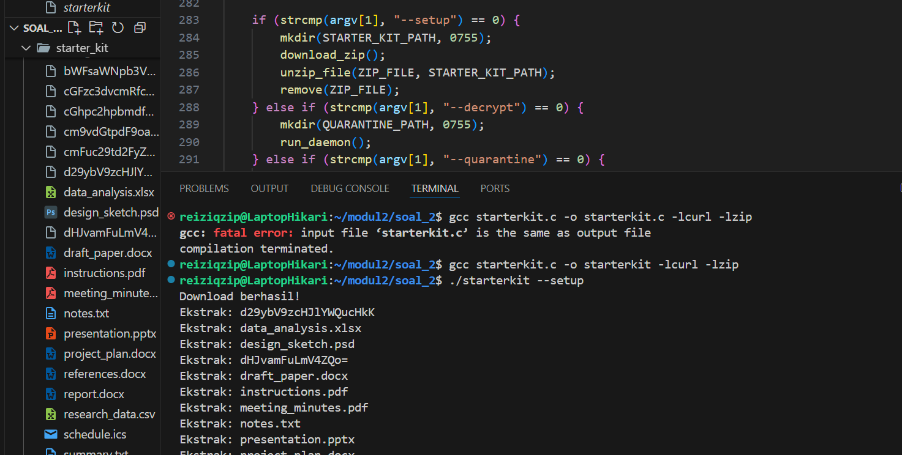
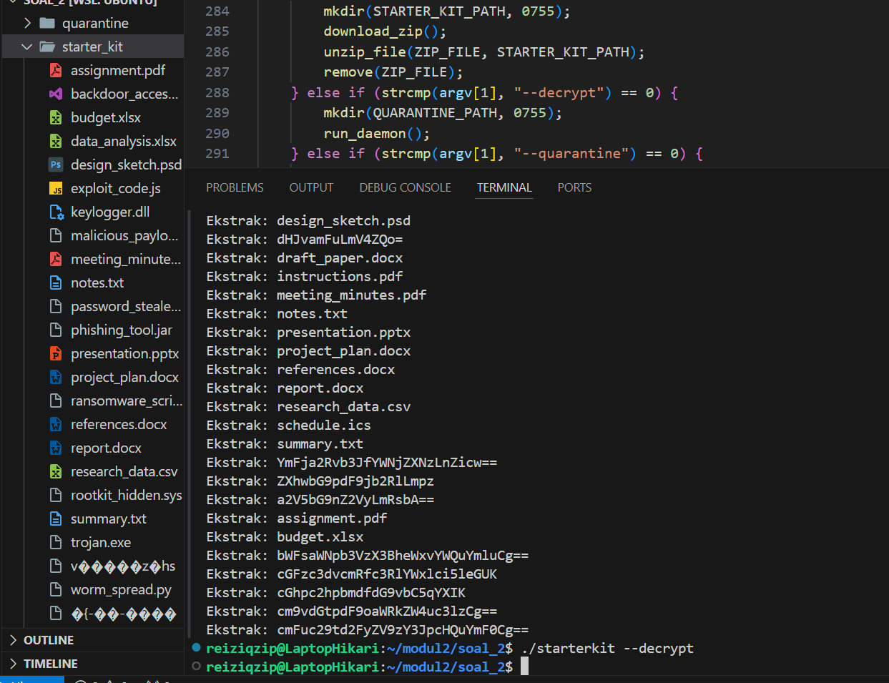
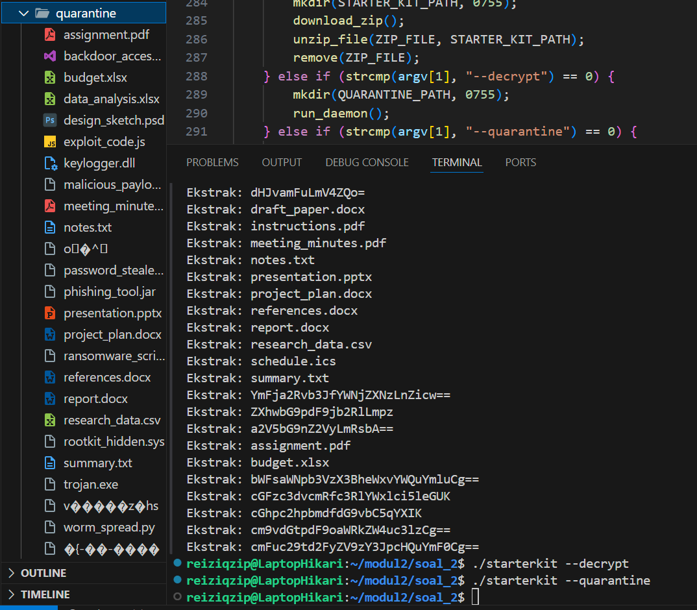
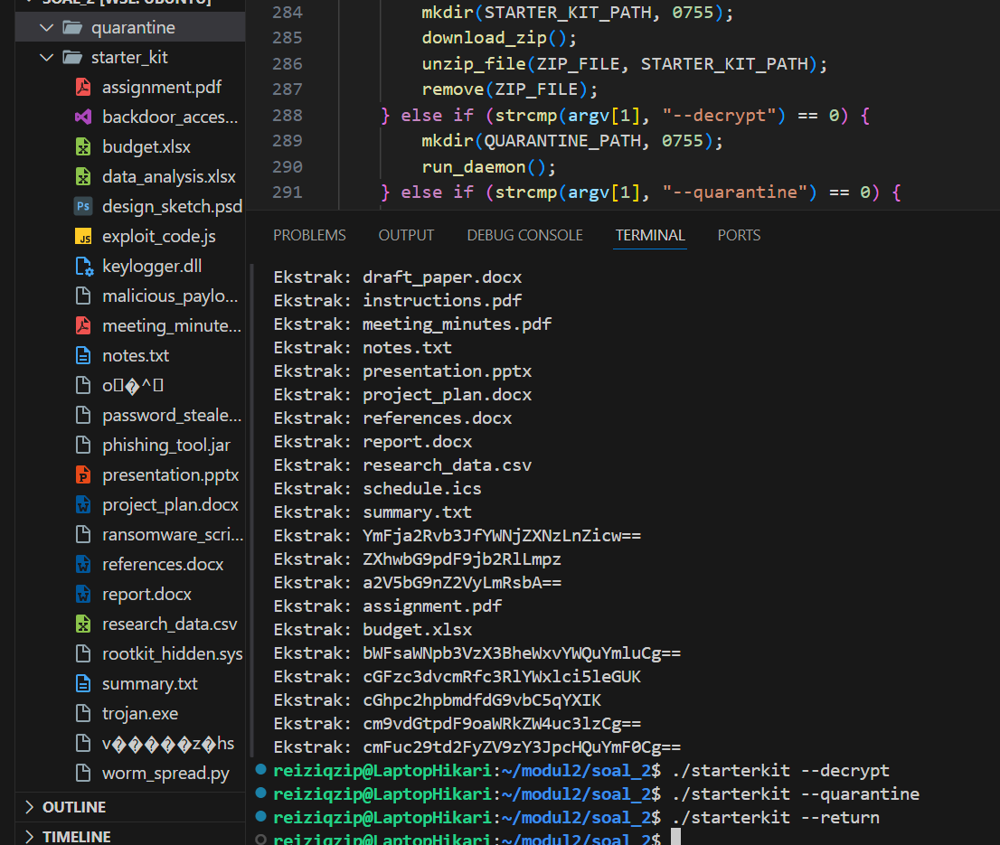
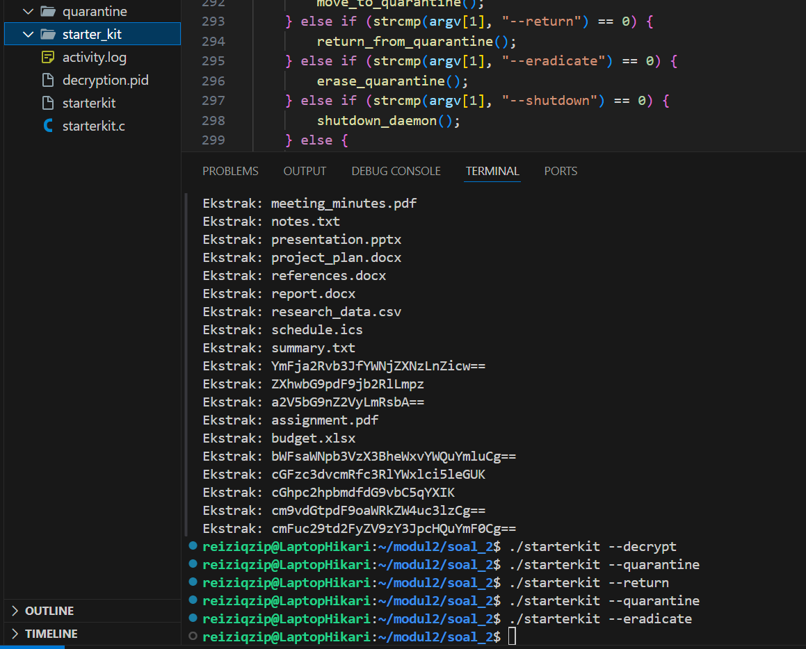
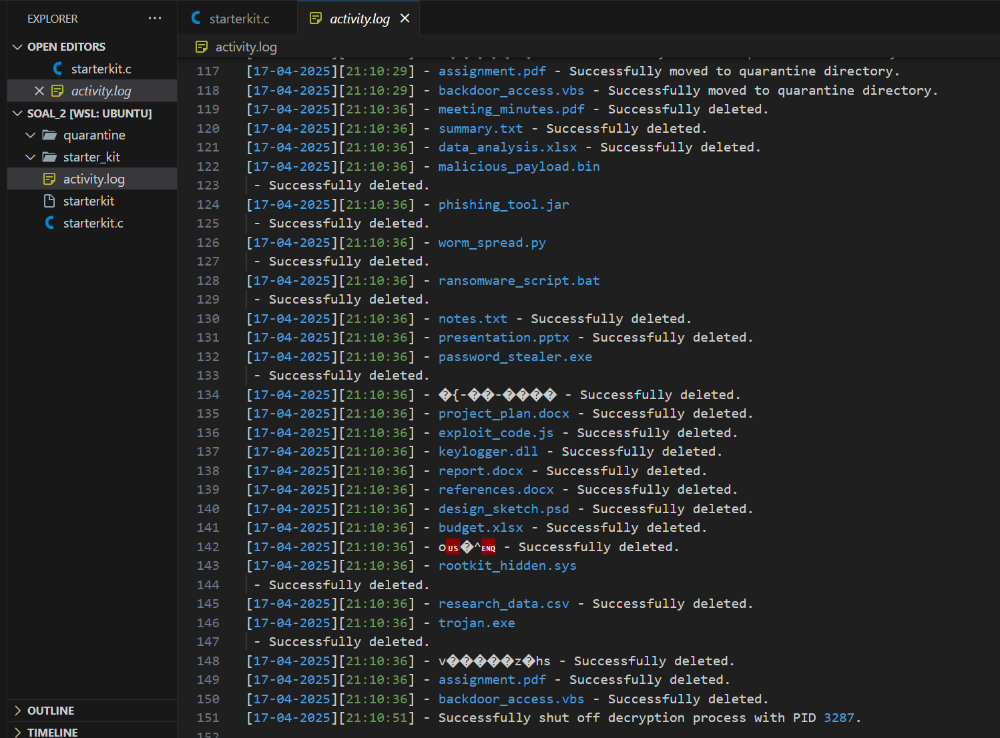
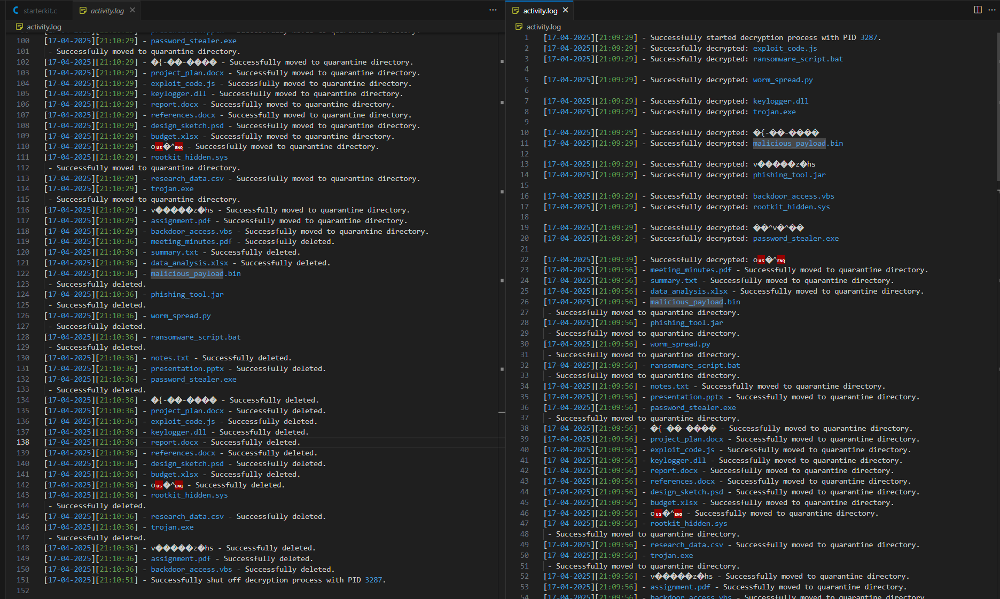
## Soal 3


## Soal 4
### Ringkasan Latar Belakang Soal

Soal ini menceritakan tentang Nobita yang menemukan alat bernama Debugmon, sebuah robot pengawas aktivitas user di komputer. Debugmon memiliki 5 fitur utama yang harus diimplementasikan dalam program C:

1. ./debugmon list reiziqzip
2. ./debugmon daemon reiziqzip
3. ./debugmon stop reiziqzip
4. ./debugmon fail reiziqzip
5. ./debugmon revert reiziqzip

Selain itu, semua aktivitas harus dicatat dalam log bernama debugmon.log dengan format:

```
[dd:mm:yyyy]-[hh:mm:ss]_nama-proses_STATUS 
```

## **A. Mengetahui semua aktivitas user (list)**

Fungsinya: Menampilkan semua proses milik user beserta PID, nama proses, CPU usage, dan memory usage.

### Code:

```c
void do_list(const char *user) {
    char cmd[128];
    snprintf(cmd, sizeof(cmd), "ps -u %s -o pid,comm,%%cpu,%%mem", user);
    FILE *fp = popen(cmd, "r");
    if (fp == NULL) {
        perror("Gagal menjalankan ps");
        return;
    }
    char line[256];
    while (fgets(line, sizeof(line), fp)) {
        printf("%s", line);
    }
    pclose(fp);
}

```

### Penjelasan:

### 1. Fungsi dan Parameter

```c
void do_list(const char *user)

```

- Ini adalah **fungsi** yang akan dipanggil ketika kita mengetik ./debugmon list <user>.
- user adalah **nama user** (misal userku: reiziqzip) yang ingin kita lihat prosesnya.

---

### 2. Menyusun perintah Linux ps

```c
char cmd[128];
snprintf(cmd, sizeof(cmd), "ps -u %s -o pid,comm,%%cpu,%%mem", user);

```

- cmd[128] adalah **string** yang akan menyimpan perintah terminal.
- snprintf() digunakan untuk menggabungkan user ke dalam perintah.
- Perintah ini akan menjadi:
    
    ```bash
    ps -u reiziqzip -o pid,comm,%cpu,%mem
    
    ```
    
- ps adalah perintah Linux untuk melihat proses.
    - u <user> → melihat proses milik user tersebut.
    - o pid,comm,%cpu,%mem → output-nya hanya menampilkan 4 kolom: ID proses, nama proses, penggunaan CPU dan memori.

---

### 3. Menjalankan perintah dan membaca hasilnya

```c
FILE *fp = popen(cmd, "r");

```

- popen() = membuka proses eksternal (di sini ps ...) dan **membaca output-nya**.
- fp adalah pointer ke stream hasil output dari perintah ps.

Jika gagal:

```c
if (fp == NULL) {
    perror("Gagal menjalankan ps");
    return;
}

```

- Menampilkan error ke terminal jika popen() gagal.

---

### 4. Menampilkan hasil baris per baris

```c
char line[256];
while (fgets(line, sizeof(line), fp)) {
    printf("%s", line);
}

```

- fgets() membaca **satu baris output** dari hasil ps.
- Lalu printf() mencetaknya ke layar.
- Proses ini diulang terus sampai tidak ada baris lagi.

---

### 5. Menutup stream

```c
pclose(fp);

```

- Menutup proses popen() yang tadi dibuka.
- Ini penting untuk menghindari kebocoran resource.

---

### Alur Logika Fungsi list

1. Terima input user dari argumen.
2. Susun perintah terminal ps untuk user tersebut.
3. Jalankan perintah tersebut menggunakan popen().
4. Baca hasilnya baris demi baris.
5. Tampilkan hasilnya ke layar.
6. Tutup proses pembacaan.

---

## **B. Memasang mata-mata dalam mode daemon (daemon)**

Fungsinya: Menjalankan proses pemantauan yang terus-menerus mencatat proses milik user ke dalam debugmon.log setiap 5 detik.

### code:

```c
void do_daemon(const char *user) {
    char failfile[64];
    snprintf(failfile, sizeof(failfile), "fail.%s", user);
    if (access(failfile, F_OK) == 0) {
        printf("User %s sedang dalam mode FAIL. Tidak bisa menjalankan daemon.\n", user);
        return;
    }

    pid_t pid = fork();
    if (pid < 0) {
        perror("Fork gagal");
        return;
    }

    if (pid > 0) {
        FILE *pf = fopen("debugmon.pid", "w");
        if (pf) {
            fprintf(pf, "%d", pid);
            fclose(pf);
        }
        printf("Debugmon sedang memantau user: %s (PID: %d)\n", user, pid);
        return;
    }

    while (1) {
        char cmd[128];
        snprintf(cmd, sizeof(cmd), "ps -u %s -o comm=", user);
        FILE *fp = popen(cmd, "r");
        if (fp) {
            char line[128];
            while (fgets(line, sizeof(line), fp)) {
                line[strcspn(line, "\n")] = 0;
                log_status(line, "RUNNING");
            }
            pclose(fp);
        }
        sleep(5);
    }
}

```

### 1. Mengecek Mode FAIL

```c
char failfile[64];
snprintf(failfile, sizeof(failfile), "fail.%s", user);
if (access(failfile, F_OK) == 0) {
    printf("User %s sedang dalam mode FAIL. Tidak bisa menjalankan daemon.\n", user);
    return;
}

```

📌 Mengecek apakah file fail.<user> ada → artinya user sedang diblokir.

Kalau iya, program langsung keluar dari fungsi (tidak lanjut fork).

---

### 2. Membuat Proses Baru dengan fork()

```c
pid_t pid = fork();

```

📌 fork() memecah program jadi 2: **parent dan child process**.

- pid > 0 → parent (induk)
- pid == 0 → child (anak)
- pid < 0 → error

---

### 3. Di Parent: Simpan PID Anak

```c
if (pid > 0) {
    FILE *pf = fopen("debugmon.pid", "w");
    fprintf(pf, "%d", pid); // simpan PID
    fclose(pf);
    return;
}

```

📌 Parent menyimpan PID child ke file debugmon.pid supaya nanti bisa dihentikan.

---

### 4. Di Child: Loop Monitoring

```c
while (1) {
    snprintf(cmd, sizeof(cmd), "ps -u %s -o comm=", user);
    FILE *fp = popen(cmd, "r");
    while (fgets(line, sizeof(line), fp)) {
        line[strcspn(line, "\n")] = 0;
        log_status(line, "RUNNING");
    }
    sleep(5);
}

```

📌 Program akan terus-menerus:

1. Menjalankan ps untuk melihat semua proses milik user
2. Membaca nama-nama prosesnya
3. Menulis ke file debugmon.log dengan status RUNNING
4. Tidur 5 detik dan ulangi lagi

---

### Output yang Dihasilkan:

Setiap 5 detik, kamu akan mendapatkan log seperti:

```
[12:04:2025]-[15:30:25]_bash_RUNNING
[12:04:2025]-[15:30:25]_code_RUNNING

```

---

### Alur Fungsi do_daemon

1. Cek apakah user dalam mode FAIL
2. Kalau tidak, buat proses baru pakai fork()
3. Parent → simpan PID daemon ke file
4. Child → jalankan loop:
    - Ambil proses
    - Tulis log
    - Tunggu 5 detik

---

## **C. Menghentikan pengawasan (stop)**

Fungsinya: Menghentikan daemon yang sedang berjalan.

### code:

```c
void do_stop() {
    FILE *pf = fopen("debugmon.pid", "r");
    if (!pf) {
        printf("Tidak ditemukan PID file. Debugmon mungkin tidak aktif.\n");
        return;
    }

    int pid;
    fscanf(pf, "%d", &pid);
    fclose(pf);

    if (kill(pid, SIGTERM) == 0) {
        printf("Debugmon (PID %d) dihentikan.\n", pid);
        remove("debugmon.pid");
    } else {
        perror("Gagal menghentikan daemon");
    }
}

```

### 1. Buka File debugmon.pid

```c
FILE *pf = fopen("debugmon.pid", "r");

```

📌 Membuka file untuk membaca PID proses daemon.

---

### 2. Baca PID dan Tutup File

```c
fscanf(pf, "%d", &pid);
fclose(pf);

```

📌 Membaca nomor PID dari file, lalu menutup file-nya.

---

### 3. Kirim Sinyal SIGTERM ke Proses

```c
kill(pid, SIGTERM);

```

📌 Ini memberitahu proses daemon: “Silakan mati dengan baik.”

Kalau berhasil, hapus file debugmon.pid.

---

### Alur Fungsi do_stop

1. Buka file debugmon.pid
2. Baca PID dari file
3. Kirim sinyal SIGTERM ke PID tersebut
4. Jika berhasil, hapus file PID

---

## **D. Menggagalkan semua proses user (fail)**

Fungsinya: Membunuh semua proses user (kecuali proses penting) dan mencatat sebagai FAILED ke log.

### code:

```c
void do_fail(const char *user) {
    printf("Mematikan semua proses milik user: %s...\n", user);

    char cmd[128];
    snprintf(cmd, sizeof(cmd), "ps -u %s -o pid=,comm=", user);
    FILE *fp = popen(cmd, "r");
    if (fp) {
        char line[256];
        while (fgets(line, sizeof(line), fp)) {
            int pid;
            char proc[128];

            // Ambil PID dan nama proses (nama bisa panjang, jadi pakai %[^\n])
            if (sscanf(line, "%d %[^\n]", &pid, proc) != 2) {
                continue;
            }

            // Lewatkan proses penting
            if (strstr(proc, "bash") || strstr(proc, "sh") ||
                strstr(proc, "debugmon") || strstr(proc, "ps") ||
                strstr(proc, "sleep")) {
                printf("Lewatkan proses: %s (PID: %d)\n", proc, pid);
                continue;
            }

            // Kirim sinyal kill dan catat ke log
            if (kill(pid, SIGKILL) == 0) {
                printf("Membunuh proses: %s (PID: %d)\n", proc, pid);
                log_status(proc, "FAILED");
            } else {
                perror("Gagal membunuh proses");
            }
        }
        pclose(fp);
    } else {
        perror("Gagal membuka output ps");
    }

    // Simpan status mode FAIL ke file
    char failfile[64];
    snprintf(failfile, sizeof(failfile), "fail.%s", user);
    FILE *fail = fopen(failfile, "w");
    if (fail) fclose(fail);

    printf("User %s sekarang dalam mode FAIL dan tidak bisa menjalankan proses baru.\n", user);
}

```

---

### Penjelasan

### 1. Cetak pesan

```c
printf("Mematikan semua proses milik user: %s...\n", user);

```

📌 Memberi tahu user bahwa proses sedang dimatikan.

---

### 2. Jalankan perintah ps untuk dapatkan PID & nama proses user

```c
snprintf(cmd, sizeof(cmd), "ps -u %s -o pid=,comm=", user);
FILE *fp = popen(cmd, "r");

```

📌 Perintah ps ini menampilkan:

- pid= → hanya PID
- comm= → hanya nama proses
Output-nya dibaca pakai popen() seperti membuka file biasa.

---

### 3. Baca baris demi baris hasil ps

```c
while (fgets(line, sizeof(line), fp)) {

```

📌 Membaca setiap baris hasil dari perintah ps.

---

### 4. Ambil PID dan nama proses

```c
sscanf(line, "%d %[^\n]", &pid, proc)

```

📌 sscanf() digunakan untuk memisahkan angka (PID) dan string nama proses.

%[^\n] artinya ambil semua karakter hingga newline (nama proses bisa mengandung spasi).

---

### 5. Lewatkan proses penting (jangan dibunuh)

```c
if (strstr(proc, "bash") || strstr(proc, "sh") || ... )

```

📌 Digunakan untuk melindungi proses seperti:

- Terminal shell (bash, sh)
- Program itu sendiri (debugmon)
- ps dan sleep agar tidak mematikan perintah yang sedang dijalankan

---

### 6. Membunuh proses

```c
kill(pid, SIGKILL)

```

📌 Mengirim sinyal SIGKILL ke proses. Ini **sinyal paksa**, langsung membunuh proses tanpa bisa menolak.

Jika berhasil, tulis ke log:

```c
log_status(proc, "FAILED");

```

---

### 7. Simpan file fail.<user>

```c
snprintf(failfile, sizeof(failfile), "fail.%s", user);
FILE *fail = fopen(failfile, "w");

```

📌 File ini menjadi penanda bahwa user sedang dalam mode **blokir**.

Fitur lain (seperti daemon) akan mengecek file ini sebelum berjalan.

---

### Alur Fungsi do_fail

1. Ambil semua proses milik user.
2. Lewatkan proses yang aman.
3. Proses lainnya dibunuh dengan SIGKILL.
4. Tulis ke log dengan status FAILED.
5. Simpan status FAIL user ke file fail.<user>.

---

## **E. Mengizinkan user menjalankan proses kembali (revert)**

Fungsinya: Menghapus mode FAIL agar user bisa menjalankan proses lagi.

### code:

```c
void do_revert(const char *user) {
    char failfile[64];
    snprintf(failfile, sizeof(failfile), "fail.%s", user);

    if (remove(failfile) == 0)
        printf("User %s keluar dari mode FAIL.\n", user);
    else
        printf("User %s tidak dalam mode FAIL.\n", user);
}

```

---

### Penjelasan Baris per Baris

### 1. Menyusun nama file mode FAIL

```c
char failfile[64];
snprintf(failfile, sizeof(failfile), "fail.%s", user);

```

📌 File fail.<user> adalah **penanda** bahwa user sedang dalam mode FAIL.

Contoh: jika user adalah reiziqzip, maka file-nya bernama fail.reiziqzip.

Fungsi snprintf() membuat nama file tersebut dan menyimpannya ke variabel failfile.

---

### 2. Menghapus file dengan remove()

```c
if (remove(failfile) == 0)

```

📌 remove() adalah fungsi dari C untuk **menghapus file**.

- Jika file fail.<user> berhasil dihapus → artinya user berhasil keluar dari mode FAIL.
- Jika file tidak ada → artinya user memang tidak sedang dalam mode FAIL.

---

### 3. Menampilkan hasil ke terminal

```c
printf("User %s keluar dari mode FAIL.\n", user);

```

📌 Memberikan umpan balik kepada pengguna bahwa mode FAIL sudah dicabut.

---

### Alur Fungsi do_revert()

1. Buat nama file fail.<user>.
2. Coba hapus file tersebut.
3. Jika berhasil → cetak pesan bahwa user sudah keluar dari mode FAIL.
4. Jika gagal → cetak pesan bahwa user tidak sedang dalam mode FAIL.

---

## **F. Pencatatan ke dalam Log (log_status)**

Fungsi:

```c
void log_status(const char *proc, const char *status) {
    FILE *log = fopen("debugmon.log", "a");
    if (!log) return;

    time_t t = time(NULL);
    struct tm *tm_info = localtime(&t);

    char date[20], timebuf[20];
    strftime(date, sizeof(date), "%d:%m:%Y", tm_info);
    strftime(timebuf, sizeof(timebuf), "%H:%M:%S", tm_info);

    fprintf(log, "[%s]-[%s]_%s_%s\n", date, timebuf, proc, status);
    fclose(log);
}

```

---

### Penjelasan

### 1. Buka file log

```c
FILE *log = fopen("debugmon.log", "a");

```

📌 Membuka file debugmon.log untuk **menambahkan** isi di akhir file (append).

---

### 2. Ambil waktu sekarang

```c
time_t t = time(NULL);
struct tm *tm_info = localtime(&t);

```

📌 Mengambil waktu sistem saat ini dalam bentuk struktur waktu lokal (tm).

---

### 3. Format tanggal dan waktu

```c
strftime(date, sizeof(date), "%d:%m:%Y", tm_info);
strftime(timebuf, sizeof(timebuf), "%H:%M:%S", tm_info);

```

📌 Mengubah waktu ke dalam bentuk teks yang bisa ditampilkan.

---

### 4. Tulis ke file

```c
fprintf(log, "[%s]-[%s]_%s_%s\n", date, timebuf, proc, status);

```

📌 Contoh hasil:

```
[12:04:2025]-[15:35:00]_firefox_FAILED
[12:04:2025]-[15:35:05]_bash_RUNNING

```

---

### 5. Tutup file log

```c
fclose(log);

```

---

### Alur Fungsi log_status

1. Buka file debugmon.log dalam mode tambah.
2. Ambil waktu sekarang dan ubah jadi string.
3. Tulis baris log ke file.
4. Tutup file.

---

## Fungsi main

```c
int main(int argc, char *argv[]) {
    if (argc < 2) {
        printf("Gunakan: ./debugmon <perintah> <user>\n");
        return 1;
    }

    const char *cmd = argv[1];
    const char *user = (argc > 2) ? argv[2] : NULL;

    if (strcmp(cmd, "list") == 0 && user) tampilkan_proses(user);
    else if (strcmp(cmd, "daemon") == 0 && user) jalankan_daemon(user);
    else if (strcmp(cmd, "stop") == 0) hentikan_daemon();
    else if (strcmp(cmd, "fail") == 0 && user) gagalkan_proses(user);
    else if (strcmp(cmd, "revert") == 0 && user) kembalikan_user(user);
    else printf("Perintah tidak dikenali atau user tidak disebutkan.\n");

    return 0;
}

```

---

## Penjelasan Baris per Baris

### 1. Memeriksa jumlah argumen

```c
if (argc < 2) {
    printf("Gunakan: ./debugmon <perintah> <user>\n");
    return 1;
}

```

📌 Mengecek apakah pengguna **sudah memasukkan perintah** atau belum.

Kalau tidak, program akan menampilkan petunjuk dan berhenti.

---

### 2. Menyimpan argumen

```c
const char *cmd = argv[1];
const char *user = (argc > 2) ? argv[2] : NULL;

```

📌 argv[1] adalah **perintah** (list, daemon, dll)

📌 argv[2] adalah **nama user** (misal: reiziqzip) jika tersedia

---

### 3. Menjalankan fungsi sesuai perintah

```c
if (strcmp(cmd, "list") == 0 && user)
    tampilkan_proses(user);
else if (strcmp(cmd, "daemon") == 0 && user)
    jalankan_daemon(user);
...

```

📌 Cek perintah satu per satu:

- Kalau list → panggil tampilkan_proses(user)
- Kalau daemon → panggil jalankan_daemon(user)
- dst…

---

### 4. Pesan error jika perintah tidak valid

```c
else printf("Perintah tidak dikenali atau user tidak disebutkan.\n");

```

📌 Jika perintah tidak cocok dengan salah satu yang ditentukan, tampilkan pesan kesalahan.

---

## Codingan lengkapnya

```cpp
#include <stdio.h>
#include <stdlib.h>
#include <string.h>
#include <unistd.h>
#include <sys/types.h>
#include <signal.h>
#include <time.h>

void log_status(const char *proc, const char *status) {
    FILE *log = fopen("debugmon.log", "a");
    if (!log) return;

    time_t t = time(NULL);
    struct tm *tm_info = localtime(&t);

    char date[20], timebuf[20];
    strftime(date, sizeof(date), "%d:%m:%Y", tm_info);
    strftime(timebuf, sizeof(timebuf), "%H:%M:%S", tm_info);

    fprintf(log, "[%s]-[%s]_%s_%s\n", date, timebuf, proc, status);
    fclose(log);
}

void do_list(const char *user) {
    char cmd[128];
    snprintf(cmd, sizeof(cmd), "ps -u %s -o pid,comm,%%cpu,%%mem", user);

    FILE *fp = popen(cmd, "r");
    if (fp == NULL) {
        perror("Gagal menjalankan ps");
        return;
    }

    char line[256];
    while (fgets(line, sizeof(line), fp)) {
        printf("%s", line); // tampilkan ke terminal
    }

    pclose(fp);
}

void do_daemon(const char *user) {
    // Check if fail mode active
    char failfile[64];
    snprintf(failfile, sizeof(failfile), "fail.%s", user);
    if (access(failfile, F_OK) == 0) {
        printf("User %s sedang dalam mode FAIL. Tidak bisa menjalankan daemon.\n", user);
        return;
    }

    pid_t pid = fork();
    if (pid < 0) {
        perror("Fork gagal");
        return;
    }

    if (pid > 0) {
        // parent
        FILE *pf = fopen("debugmon.pid", "w");
        if (pf) {
            fprintf(pf, "%d", pid);
            fclose(pf);
        }
        printf("Debugmon sedang memantau user: %s (PID: %d)\n", user, pid);
        return;
    }

    // child (daemon)
    while (1) {
        char cmd[128];
        snprintf(cmd, sizeof(cmd), "ps -u %s -o comm=", user);
        FILE *fp = popen(cmd, "r");
        if (fp) {
            char line[128];
            while (fgets(line, sizeof(line), fp)) {
                line[strcspn(line, "\n")] = 0; // trim newline
                log_status(line, "RUNNING");
            }
            pclose(fp);
        }
        sleep(5);
    }
}

void do_stop() {
    FILE *pf = fopen("debugmon.pid", "r");
    if (!pf) {
        printf("Tidak ditemukan PID file. Debugmon mungkin tidak aktif.\n");
        return;
    }

    int pid;
    fscanf(pf, "%d", &pid);
    fclose(pf);

    if (kill(pid, SIGTERM) == 0) {
        printf("Debugmon (PID %d) dihentikan.\n", pid);
        remove("debugmon.pid");
    } else {
        perror("Gagal menghentikan daemon");
    }
}

void do_fail(const char *user) {
    printf("Mematikan semua proses milik user: %s...\n", user);

    char cmd[128];
    snprintf(cmd, sizeof(cmd), "ps -u %s -o pid=,comm=", user);
    FILE *fp = popen(cmd, "r");
    if (fp) {
        char line[256];
        while (fgets(line, sizeof(line), fp)) {
            int pid;
            char proc[128];

            // Ambil PID dan nama proses (nama bisa panjang, jadi pakai %[^\n])
            if (sscanf(line, "%d %[^\n]", &pid, proc) != 2) {
                continue;
            }

            // Lewatkan proses penting
            if (strstr(proc, "bash") || strstr(proc, "sh") ||
                strstr(proc, "debugmon") || strstr(proc, "ps") ||
                strstr(proc, "sleep")) {
                printf("Lewatkan proses: %s (PID: %d)\n", proc, pid);
                continue;
            }

            // Kirim sinyal kill dan catat ke log
            if (kill(pid, SIGKILL) == 0) {
                printf("Membunuh proses: %s (PID: %d)\n", proc, pid);
                log_status(proc, "FAILED");
            } else {
                perror("Gagal membunuh proses");
            }
        }
        pclose(fp);
    } else {
        perror("Gagal membuka output ps");
    }

    // Simpan status mode FAIL ke file
    char failfile[64];
    snprintf(failfile, sizeof(failfile), "fail.%s", user);
    FILE *fail = fopen(failfile, "w");
    if (fail) fclose(fail);

    printf("User %s sekarang dalam mode FAIL dan tidak bisa menjalankan proses baru.\n", user);
}

void do_revert(const char *user) {
    char failfile[64];
    snprintf(failfile, sizeof(failfile), "fail.%s", user);
    if (remove(failfile) == 0) {
        printf("User %s telah keluar dari mode FAIL.\n", user);
    } else {
        printf("User %s tidak dalam mode FAIL.\n", user);
    }
}

int main(int argc, char *argv[]) {
    if (argc < 2) {
        printf("Gunakan perintah: list|daemon|stop|fail|revert <user>\n");
        return 1;
    }

    const char *cmd = argv[1];
    const char *user = argc > 2 ? argv[2] : NULL;

    if (strcmp(cmd, "list") == 0 && user) do_list(user);
    else if (strcmp(cmd, "daemon") == 0 && user) do_daemon(user);
    else if (strcmp(cmd, "stop") == 0) do_stop();
    else if (strcmp(cmd, "fail") == 0 && user) do_fail(user);
    else if (strcmp(cmd, "revert") == 0 && user) do_revert(user);
    else printf("Perintah tidak dikenali atau user tidak disebutkan.\n");

    return 0;
}

```

##Gambar Pendukung
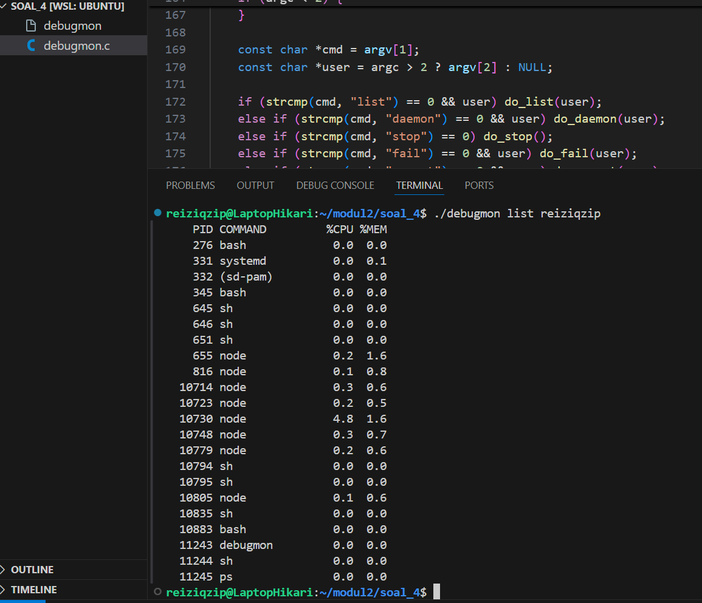
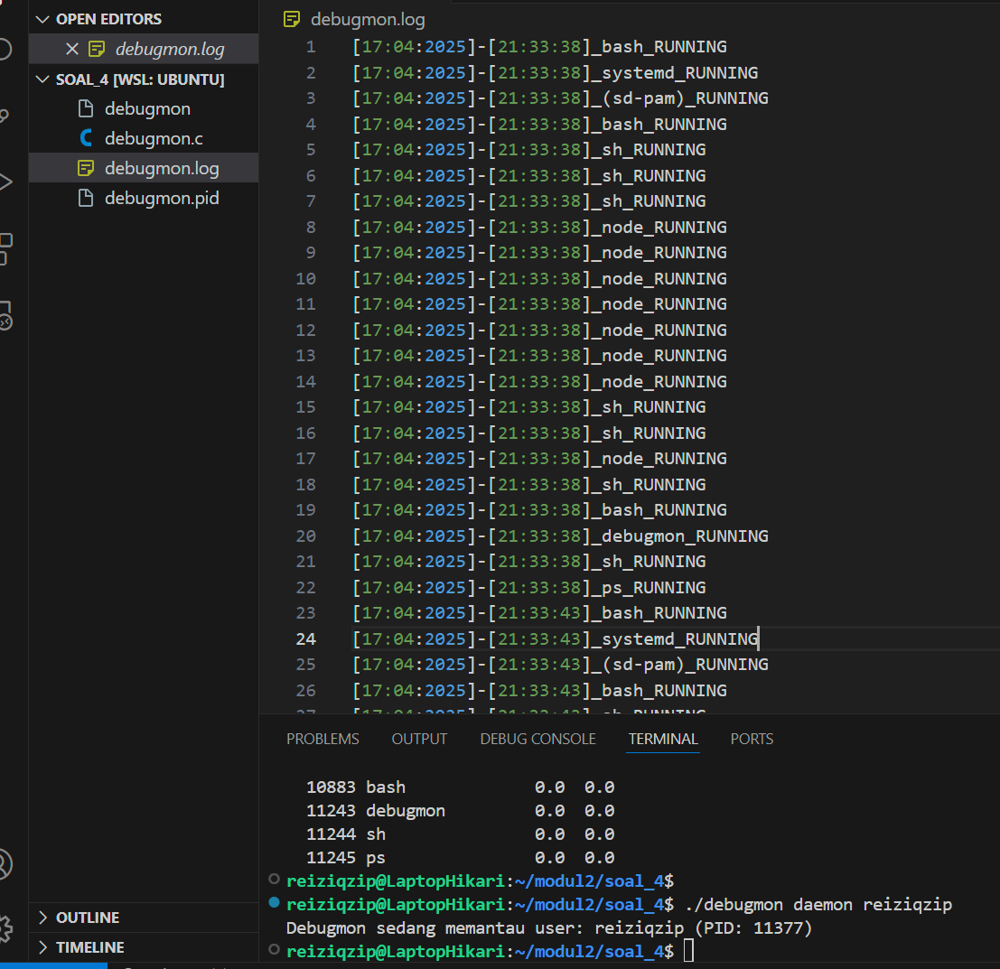
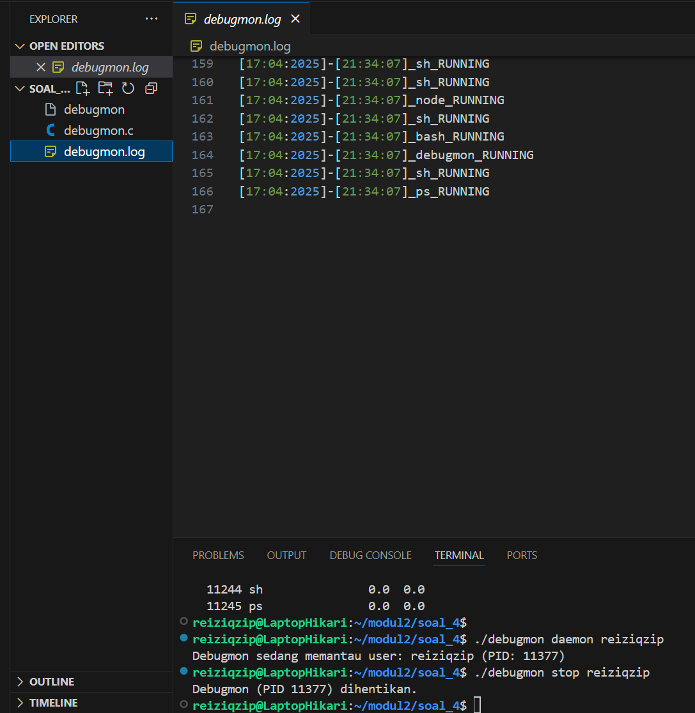
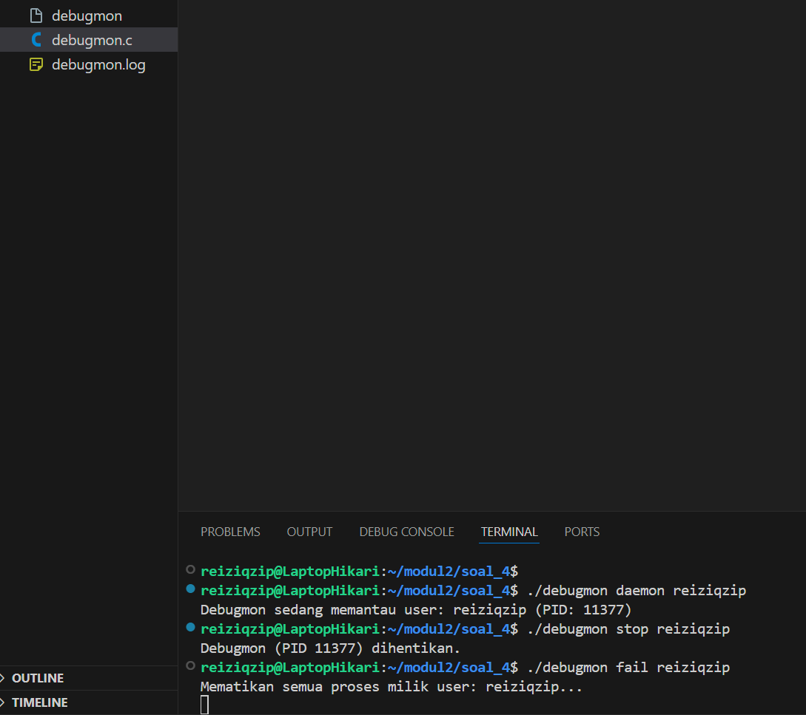
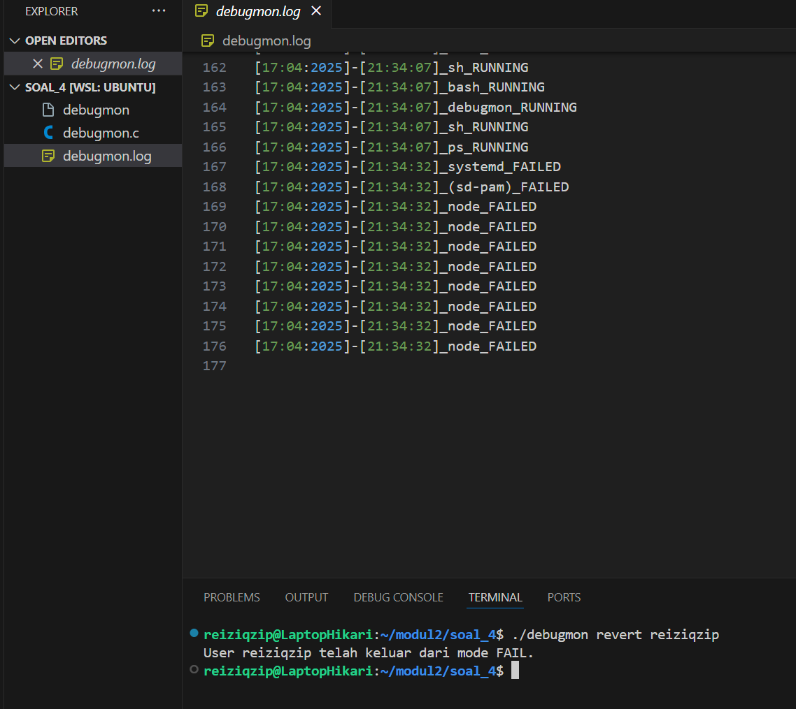
